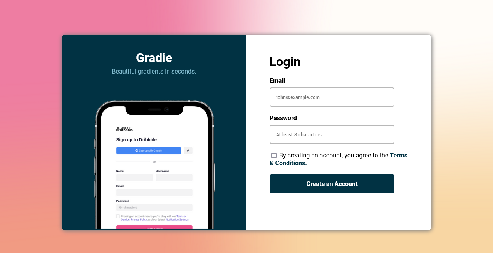
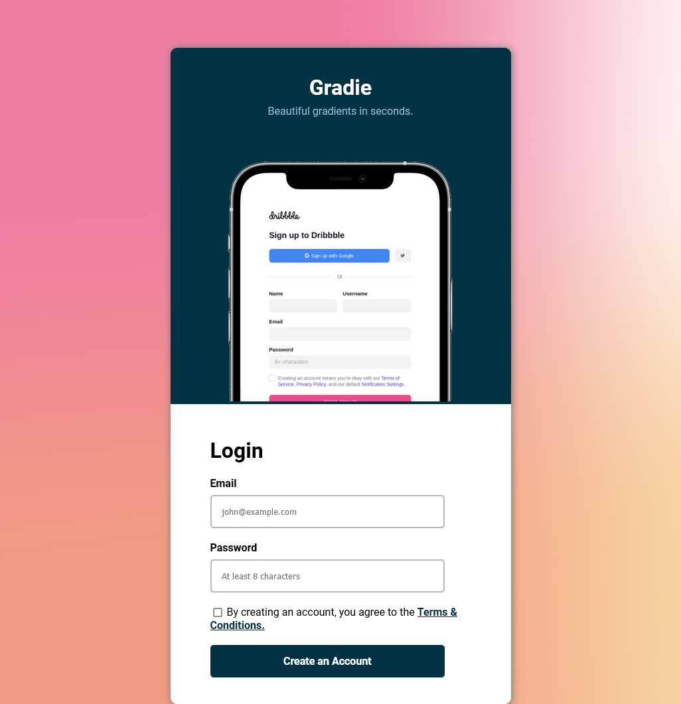
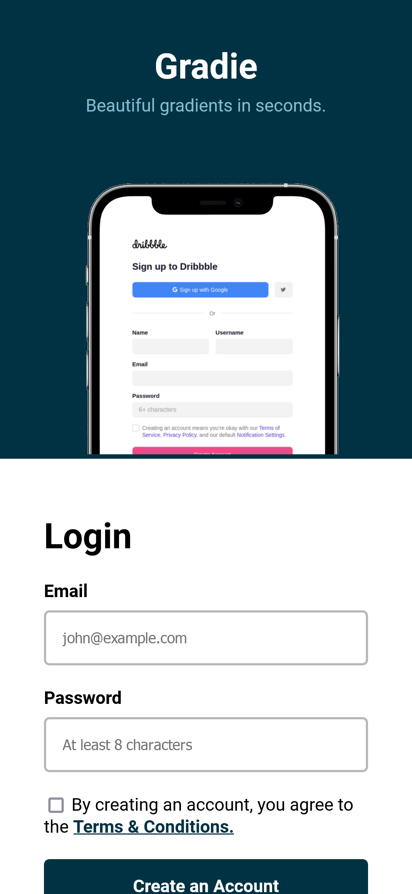

# Codewell - Gradie Sign Up page solution

This is a solution to the [Gradie Sign Up Page on Codewell.cc](https://www.codewell.cc/challenges/gradie-sign-up-page--608ac420650dff001599e8ec). Codewell challenges help you improve your coding skills by building realistic projects. 

## Table of contents

- [Overview](#overview)
  - [The challenge](#the-challenge)
  - [Screenshot](#screenshot)
  - [Links](#links)
- [My process](#my-process)
  - [Built with](#built-with)
  - [Useful resources](#useful-resources)
- [Author](#author)

## Overview

### The challenge

The task was to recreate the simple sign-up page as it is great in practicing centering layouts and absolute positioning.

### Screenshot

### Links

- Solution URL: [Github](https://github.com/KahlvynO/Gradie-signup)
- Live Site URL: [Netlify](https://gradie01.netlify.app)

## My process

### Built with

- Semantic HTML5 markup
- CSS
- Flexbox

### Useful resources

- [W3schools](https://www.w3schools.com) - This served as a refresher for me when i needed a quick reminder of a certain syntax that skipped my mind or new styles that the project needed that i didn't know the correct syntax for.

## Author

- Website - [Calcodez](https://calcodez.netlify.app)
- Twitter - [@calcodez](https://www.twitter.com/calcodez)